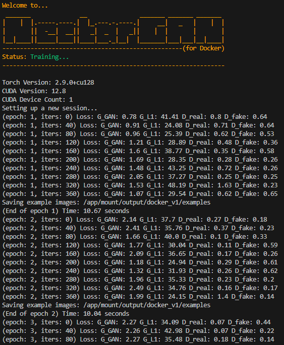
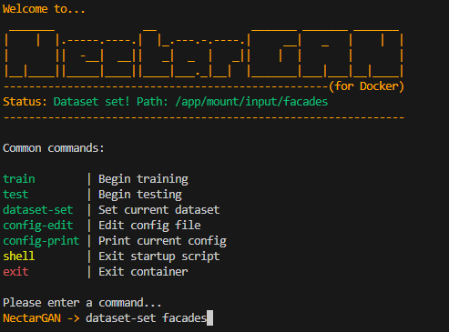

# NectarGAN - Getting Started (Docker)
#### This section will walk you through the process of using NectarGAN from a Docker container.
> [`Getting Started - Home`](../getting_started.md)

## Before you start...
### Docker
To follow this guide, you must first have Docker desktop installed on your host machine.

To get started with Docker, see here: https://www.docker.com/

### Visdom
NectarGAN uses [Visdom](https://github.com/fossasia/visdom) for data visualization when running inside of a container. A Visdom server is set up automatically during during build/compose and configured to listen to the main NectarGAN `app` service, and also to route its output through an open port on the container (`8000` by default). This will be explained in greated detail below.

## Building/Running the Container
**First, clone the repository:**
```bash
git clone https://github.com/ZacharyBork/NectarGAN.git
```
**Next, run:**
```bash
cd NectarGAN/docker
```
**From here, we can run:**
```bash
docker compose build --build-arg TORCH_TYPE=cpu
```
Setting the value of `TORCH_TYPE` will tell the Dockerfile which PyTorch compute platform you intend on using so that it can download the wheel from the correct place. The build process will also automatically set the device in the `docker_nectargan_config.json` (explained below) to the correct value for the given platform. Currently, the available options are:

- `cpu`&nbsp;&nbsp;&nbsp; : CPU-only
- `cu126` : CUDA 12.6
- `cu128` : CUDA 12.8

The image size for the `cpu` build is ~2GB. The `cu1**` builds are ~12GB. If this arugment is not set, the build will default to `cpu`.

**After the build has finished, we can run:**
```bash
docker compose up -d
```
After a few seconds, you should see messages that both the `app` and `visdom` services have started successfully, after which time, you can navigate to `http://localhost:8000` on your host machine to view the Visdom output.

## Files and Structure
Let's have a quick look at the file and directory structure for NectarGAN's Docker build:
```
NectarGAN/
└── docker/
    ├── mount/
    │   ├── docker_nectargan_config.json
    │   ├── input
    │   └── output
    ├── scripts/
    │   ├── config_editor.py
    │   ├── nectargan.py
    │   └── etc.
    ├── visdom/
    │   ├── Dockerfile
    │   └── start_server.sh
    ├── .dockerignore
    ├── .env
    ├── docker-compose.yaml
    ├── Dockerfile
    └── entrypoint.sh
```
**There are a couple key things to note:**

1. **The `mount` directory:** This gets mounted as a runtime volume.
2. **`docker_nectargan_config.json`:** This is the training/testing config file used by the scripts inside of the container. Note that, since it is in the `mount` directory, you are able to make live edits to this file with the container running.
3. **The `mount/input` directory:** This is the directory where you will place your dataset directories for training and testing models inside of the container. This will be explained in greater detail below.
4. **The `mount/output` directory:** This is the directory where NectarGAN will export data to (checkpoints, example images, logs). This will also be explained in greater detail below.
5. **The `.env` file:** This file currently is only used to configure the Visdom endpoint for the container.

Everything else is related to the build/compose process. The above files/directories are the primary things you will be using to interact with and change the behavior of your container.

## Interacting with the Container
**With our container running, we can now run:**
```bash
docker exec -it nectargan-app-1 nectargan
```
After doing so, you will be greeted with a screen which looks like this:


This is the NectarGAN Docker CLI wrapper. From here, we can run commands to interact with NectarGAN inside of the container. Currently, these commands are:

### `train`
This command allows you to run model training from within the container. The configuration values for the training session will be pulled from the `docker_nectargan_config` file, but can be edited from the CLI wrapper (explained below).

When run, a Visdom client will be created in the `app` service to send loss data and example images to the `visdom` service, a new experiment directory will be created in the mounted `output` directory, and training will be begin. Soon after, you should begin to see logging information in your console and updates in Visdom on your host machine.



**As shown in the above image, all of the training outputs (i.e. checkpoints, logs, example images) will be saved to the mounted `output` directory,** so that they can be accessed immediately on the host machine.

Currently, the only way to stop training prematurely is via `Ctrl+C`. This also exits the container shell meaning you need to re-run the `exec` command after. This will be fixed in a future update though.

### `test`
This command will run a multi-step guided process for initializing a model testing session. When you run it, you will be asked to:

1. Choose an experiement to test. (from the mounted `output` directory)
2. Choose an epoch to load.
3. Choose a dataset to test the model on. (from the mounted `input` directory)
4. Choose a number of test iterations to run. Each iteration will test the model's interence on a single image from the given dataset's `test` directory.

All testing results (logs, output images) are exported to the experiment directory of the experiment being tested, in a subdirectory called `test`, inside of the mounted `output` directory.

### `dataset-set`
This command allows you to set the currently active dataset (`dataroot`) in the `docker_nectargan_config` file to any dataset directory in the mounted input directory.

This is done by running the base command, followed by the name of the dataset directory. For example, if you had a dataset called `facades`, and you would like to train with this dataset inside of the container, first you would place your `facades` directory inside of the mouted input directory, giving you a directory structure like so:
```
NectarGAN/
└── docker/
    ├── Dockerfile
    ├── docker-compose.yaml
    └── mount/
        ├── docker_nectargan_config.json <--------- NectarGAN Docker training/testing config
        └── input/
            └── facades/ <------------------------- Your dataset
                ├── train/
                │   └── training_images
                ├── test/
                │   └── traing_images
                └── val/
                    └── validation_images
```
**Then, in the NectarGAN Docker CLI wrapper,** we can run:
```bash
dataset-set facades # Replace "facades" with the name of your actual dataset directory.
```
This will set the config `dataroot` path to the facades directory in the mounted volume, if it exists. You will recieve a confirmation message in the status field if it is successful, as shown in the image below.



### `config-edit`
This command will begin a guided multi-step process which allows you to edit the current value of a field in the `docker_nectargan_config` file.

**Please note:** since the `docker_nectargan_config` file is located inside of the mount directory, you may also edit the file in a text editor on your host machine, and updates will be picked up immediately. This is much easier for large changes. This command is largely provided as a convenience.

### `config-print`
Running this command will print the current config file in raw JSON format to the console.

### `shell`
This will stop the NectarGAN Docker CLI wrapper, and drop you in to the container's native shell. The base image for the `nectargan-app` image is `python:3.12-slim-bookworm`, so it is a Debian shell. 

To return to the NectarGAN Docker CLI wrapper, you can run the command `nectargan`. Please note, though, that after doing this, the next time you run the `exit` command, rather than exiting the container, you will instead be placed back in the container shell, as that is the new parent process. Running `exit` again, though, will exit the container.

This is also mostly provided as a convenience. It is the same as running `docker exec -it nectargan-app-1 /bin/sh` from the host machine.

### `exit`
This will exit the interactive container shell (or exit to the interactive container shell, as noted above).