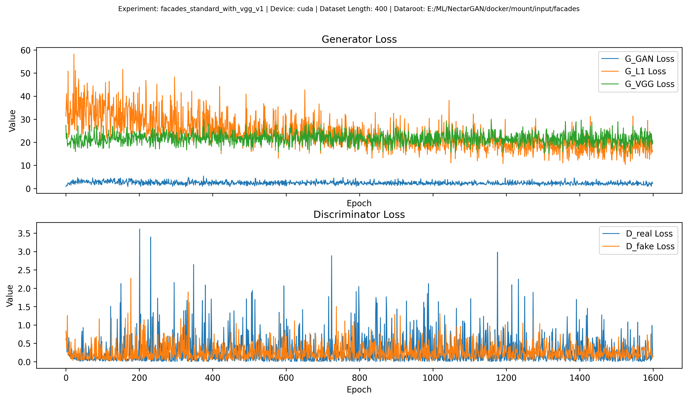
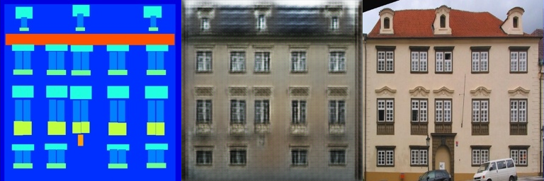
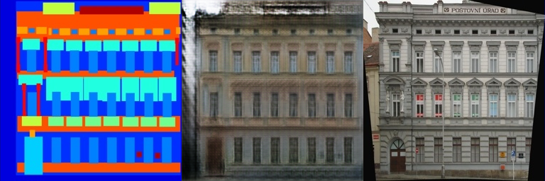
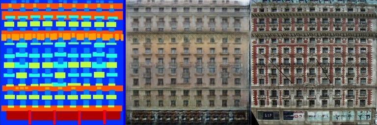
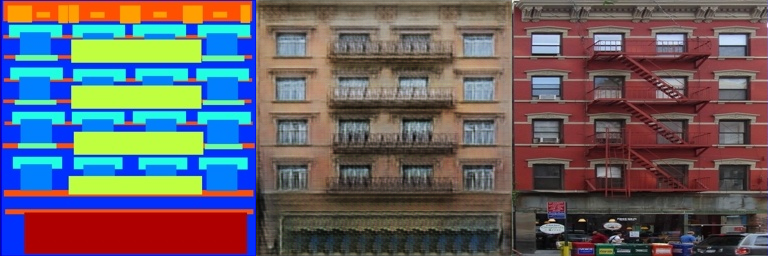
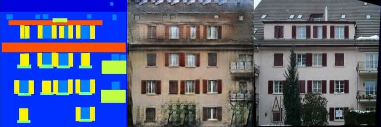
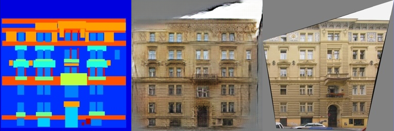
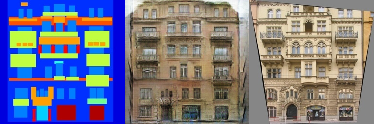
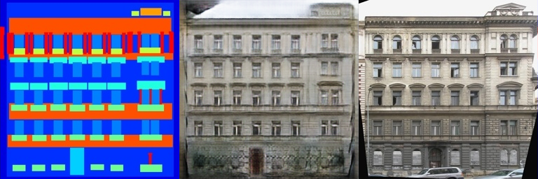

# NectarGAN Examples - UNet (basic+vgg)
**Config: [config.json](config.json)**
## Test parameters:
| `block_type` | `lambda_gan` | `lambda_l1` | `lambda_l2` | `lambda_sobel` | `lambda_laplacian` | `lambda_vgg` |
| --- | --- | --- | --- | --- | --- | --- |
| ResidualUnetBlock | 1.0 | 100.0 | 0.0 | 0.0 | 0.0 | 10.0 |
## Loss Graphs

## Examples
| Epoch | {Input, Generated, Target} |
| --- | --- |
| 1 |  |
| 20 |  |
| 40 |  |
| 60 |  |
| 80 |  |
| 100 |  |
| 120 |  |
| 140 |  |
| 160 |  |
| 180 |  |
| 200 |  |
